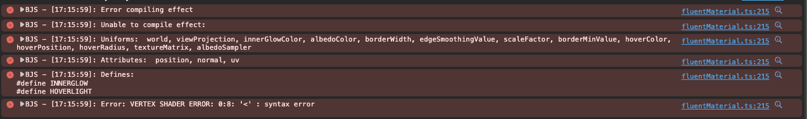
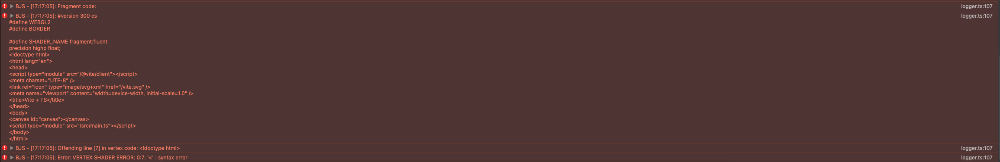
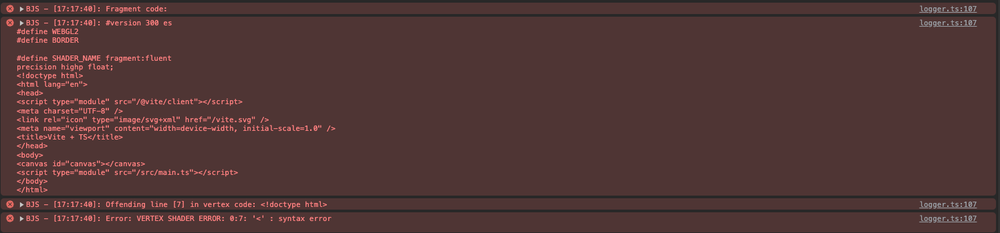

# bjs-vite-bug

## To reproduce

```cmd
cd bjs-vite-bug
npm i
npm run dev
```

Open browser

## Summary

Edge: 
Safari: 
Chrome: 

Seems like somehow `index.html` content appears in shader code and breaks it.
